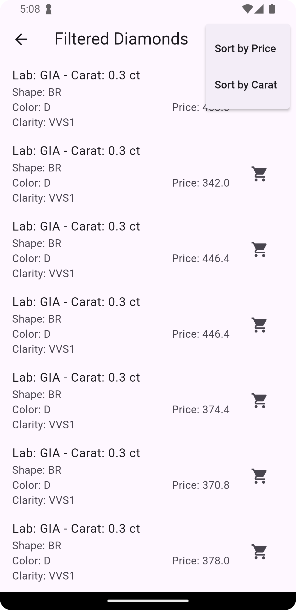
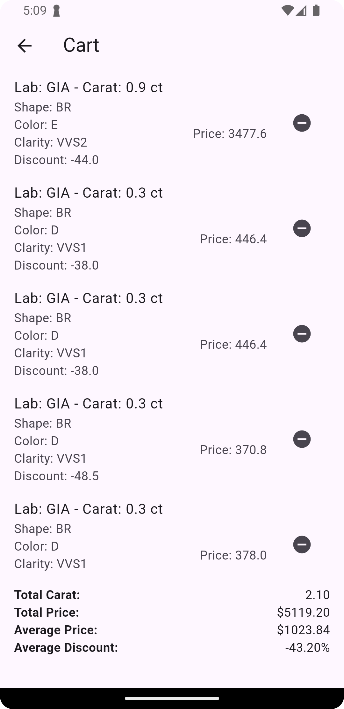

# KGK Diamonds Filtering App

## Overview

The **KGK Diamonds Filtering App** is a Flutter-based application that allows users to filter, sort, and select diamonds based on various criteria. The app utilizes **BLoC for state management**, **sqflite for persistent storage**, and provides a smooth user experience with a well-structured UI.

## Features

- Filtering diamonds based on Carat, Lab, Shape, Color, and Clarity.
- Sorting diamonds by Price and Carat.
- Persisting cart data using SQLite (`sqflite`).
- User-friendly UI with real-time filtering updates.

## Project Structure

```
lib/
│── bloc/                # BLoC state management
│   │── diamond_bloc.dart
│   │── events.dart
│
│── database/            # Persistent storage
│   │── database_helper.dart
│
│── model/               # Data models
│   │── diamond.dart
│
│── ui/                  # UI components
│   │── cart_page.dart
│   │── home_screen.dart
│   │── result_page.dart
│
│── utils/               # Utility functions
│   │── show_message.dart
│
│── main.dart            # Entry point of the app
```

## State Management

The app uses **BLoC (Business Logic Component)** to manage state efficiently:

- **diamond\_bloc.dart**: Handles business logic, including filtering and sorting.
- **events.dart**: Defines events such as loading data, applying filters, and sorting.

### BLoC Workflow:

1. `loadData()` fetches diamond data from a local JSON file.
2. `applyFilters()` applies the user's selected filter criteria.
3. `sortDiamonds()` sorts the filtered list based on selected sorting criteria.
4. The UI listens to state changes and updates dynamically.

## Persistent Storage

- The app uses **sqflite** for saving and retrieving selected diamonds in the cart.
- `database_helper.dart` handles SQLite database operations such as inserting, retrieving, and deleting cart items.

## Application Preview

<h3>App Screenshots</h3>

<p float="left">
  
  
  
</p>


## Setup & Installation

1. Clone the repository:
   ```sh
   git clone https://github.com/your-repo/diamond-selection-app.git
   ```
2. Navigate to the project folder:
   ```sh
   cd diamond-selection-app
   ```
3. Install dependencies:
   ```sh
   flutter pub get
   ```
4. Run the app:
   ```sh
   flutter run
   ```

## Dependencies

- flutter\_bloc
- sqflite
- path\_provider

